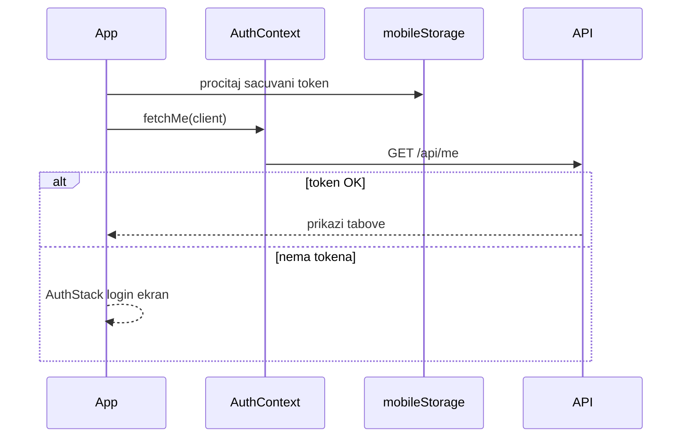
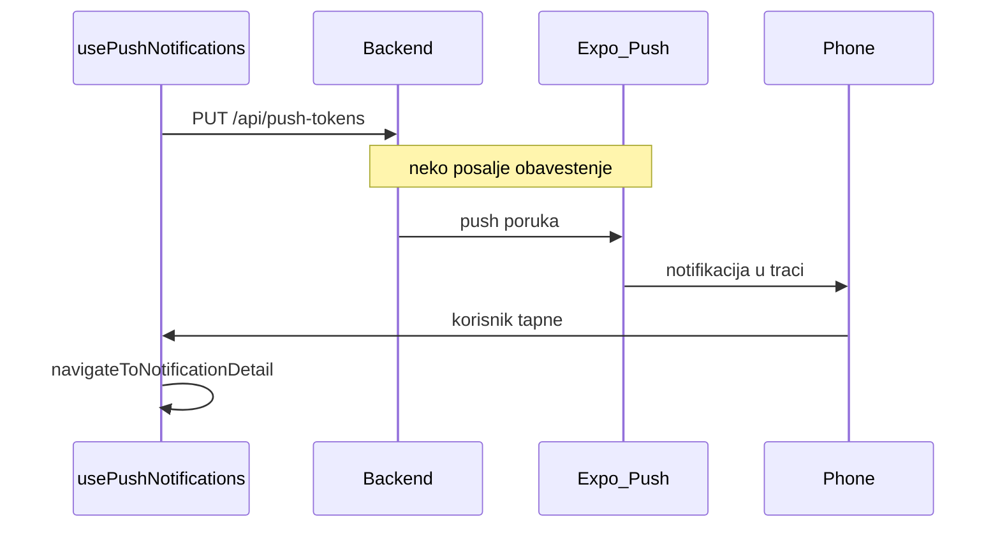

# Mobile — debug vodič

## Šta je ovo

Mobilna aplikacija **Planiner** (Expo / React Native). Radi na Androidu (i iOS). Isti backend kao web, isti shared paket za API pozive.

## Kako pokrenuti

```bash
cd apps/mobile
npm install
npm start          # Expo dev server
npm run android    # na emulatoru ili telefonu
```

- API URL: `EXPO_PUBLIC_API_URL` u `.env`, ili podrazumevano `https://planiner-api.onrender.com`
- Za **push, GPS u pozadini, Health Connect, MapLibre** treba pravi APK build — Expo Go to ne pokriva sve

```bash
npm run build:apk    # EAS Android APK
npm run update:apk   # OTA update samo JS koda (bez novog APK-a)
```

Detalji build-a i push-a: [`BUILD_APK.md`](BUILD_APK.md).

## Odakle kreće kod

```
index.ts                    ← background taskovi (GPS, koraci)
  └── App.tsx               ← provajderi
        └── RootNavigator   ← login? → tabovi ili auth ekrani
              └── AppTabs     ← 5 tabova
```

## Mapa foldera

| Folder | Šta tu radi |
|--------|-------------|
| `src/features/` | Ekrani po domenu — svaki podfolder = jedna oblast app-a |
| `src/navigation/` | Tabovi, stackovi, deep linkovi |
| `src/navigation/stacks/` | HomeStack, ActionsStack, ExploreStack, ClubStack, ProfileStack |
| `src/components/ui/` | Dugmad, kartice, inputi, loader |
| `src/context/` | Auth, koraci, modal prozori |
| `src/api/client.ts` | Veza sa backendom (`createApiClient` + mobile storage) |
| `src/hooks/` | Push obaveštenja, OTA update, superadmin klub |
| `src/storage/` | Token (SecureStore), ostalo (AsyncStorage) |
| `src/i18n/` | Prevodi (sr) |
| `src/theme/` | Boje, razmaci, fontovi |

### Features — šta gde

| Folder u `features/` | Šta radi |
|----------------------|----------|
| `home/` | Feed, composer za post |
| `actions/` | Lista akcija, detalj, wizard, prošle akcije |
| `explore/` | Istraži, ferate, mapa, vodiči, koraci |
| `activity/` | Započni avanturu (GPS, timer, stiker) |
| `club/` | Klub, članovi |
| `finance/` | Finansije |
| `tasks/` | Zadaci |
| `notifications/` | Lista i detalj obaveštenja |
| `profile/` | Moj profil, podešavanja, postani vodič |
| `auth/` | Login, registracija, zaboravljena lozinka |
| `superadmin/` | Superadmin klubovi |

## Navigacija — 5 tabova

Fajl: `src/navigation/AppTabs.tsx`

| Tab | Stack | Glavni ekrani |
|-----|-------|---------------|
| Home | `HomeStack` | Feed, obaveštenja, detalj obaveštenja |
| Akcije | `ActionsStack` | Lista, detalj, wizard, dodaj prošlu |
| Istraži | `ExploreStack` | Ferate, mapa, koraci, avantura |
| Klub | `ClubStack` | Klub, članovi, zadaci, finansije |
| Profil | `ProfileStack` | Profil, podešavanja |

Bez logina: `AuthStack` (login, registracija…).

## Glavni tokovi

### Prijava i sesija



### Obaveštenja — dva načina

**In-app lista** (uvek radi kad si ulogovan):
- `HomeScreen` povlači nepročitana na ~60 sekundi
- `NotificationsScreen` — puna lista
- Ovo **nije** push — samo učitavanje sa servera

**Push na telefon** (kad je app ugašena):
- `usePushNotifications` u `RootNavigator` — dozvole, Expo token, registracija na backend
- Backend šalje preko Expo → FCM → telefon
- Tap na notifikaciju → `NotificationDetail` ekran



### Deep link

`src/navigation/linking.ts` — otvaranje akcije, profila, obaveštenja iz linka (`planiner://` ili https).

## Gde da tražiš po funkciji

| Tražiš… | Gde |
|---------|-----|
| Push ne stiže | `src/hooks/usePushNotifications.ts`, [`BUILD_APK.md`](BUILD_APK.md) Push sekcija |
| Obaveštenje tek kad otvoriš app | Normalno bez FCM; vidi BUILD_APK |
| Ime u obaveštenju | `features/notifications/NotificationDetailScreen.tsx` |
| Login / logout | `src/context/AuthContext.tsx` |
| API greška | `src/api/client.ts`, `EXPO_PUBLIC_API_URL` |
| Tab / navigacija | `src/navigation/` |
| Akcija wizard | `features/actions/` |
| Ferata detalj | `features/explore/FerrataDetailScreen.tsx` |
| GPS avantura | `features/activity/` |
| Dnevni koraci | `features/steps/` |
| Mapa | `components/map/`, env `EXPO_PUBLIC_MAPTILER_API_KEY` |

## Kad nešto ne radi — gde gledati

| Simptom | Gde gledati |
|---------|-------------|
| Vidiš obaveštenje tek kad uđeš u app | Push/FCM nije podešen — [`BUILD_APK.md`](BUILD_APK.md) koraci A–C |
| „Korisnik" umesto imena | `NotificationDetailScreen.tsx` → `resolveProfileFromNotification` |
| 401 / izbaci na login | `AuthContext`, token u SecureStore |
| Mapa ne radi | `.env` ključ; treba APK sa MapLibre, ne Expo Go |
| Koraci 0 na Androidu | Health Connect instaliran? Novi APK (versionCode 8+) |
| GPS ne radi u pozadini | Dozvola lokacije „uvek"; foreground notifikacija avanture |
| Promena JS-a ne stiže na telefon | `npm run update:apk` (OTA) ili novi APK ako je native modul |
| Build pada na google-services.json | Dodaj Firebase fajl u `apps/mobile/` pre build-a |

## Native vs OTA — šta zahteva novi APK

| Menjaš | Šta uraditi |
|--------|-------------|
| Samo TS/JS (ekrani, logika) | `npm run update:apk` |
| `app.json`, dozvole, novi native modul | `npm run build:apk` + nova instalacija |
| Push / FCM | Firebase setup + novi APK |

## Povezano

- APK build i push: [`BUILD_APK.md`](BUILD_APK.md)
- Deep linkovi: [`DEPLOY.md`](DEPLOY.md)
- Zajednički kod: [`packages/shared/DEBUG.md`](../../packages/shared/DEBUG.md)
- Backend: [`backend/DEBUG.md`](../../backend/DEBUG.md)
