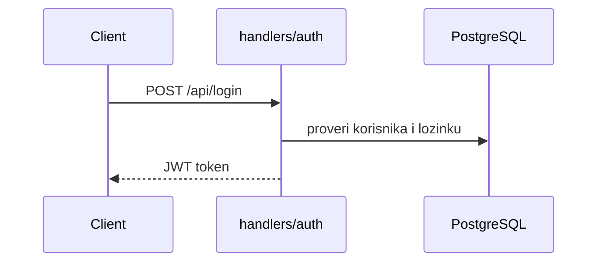
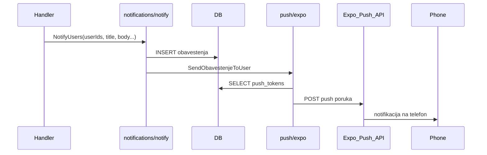
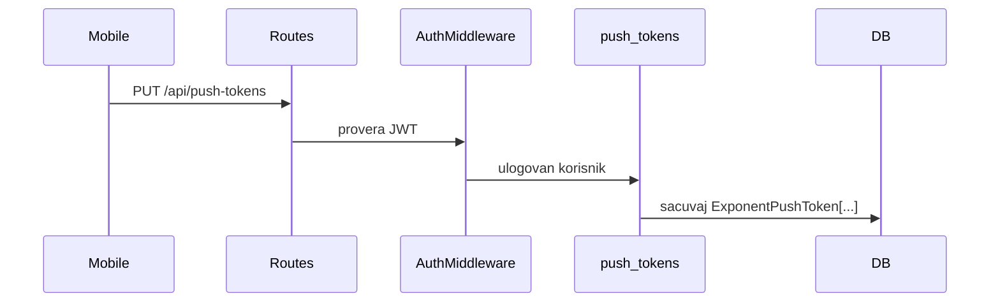

# Backend — debug vodič

## Šta je ovo

Go server koji prima zahteve od web-a i mobilne app, čita/piše u PostgreSQL bazu i šalje email i push obaveštenja.

Sve API rute počinju sa `/api/...` (osim `/health`, `/ready`, `/login`).

## Kako pokrenuti

```bash
cd backend
# napravi .env sa JWT_SECRET i DATABASE_URL
go run .
```

- Server: `http://localhost:8080`
- Provera da radi: `GET /health` (živ), `GET /ready` (baza dostupna)

Za produkciju i env varijable vidi [`DEPLOY.md`](DEPLOY.md).

## Odakle kreće kod

```
main.go
  └── internal/app/app.go     ← učitava .env, bazu, migracije, pokreće server
        └── internal/routes/app_routes.go   ← registruje sve rute
              └── internal/handlers/*.go    ← šta se dešava po zahtevu
```

## Mapa foldera

| Folder | Šta tu radi |
|--------|-------------|
| `internal/routes/` | Koji URL vodi gde — podeljeno po domenu (akcije, klub, obaveštenja…) |
| `internal/handlers/` | Logika kad stigne HTTP zahtev — jedan ili više fajlova po oblasti |
| `internal/models/` | Strukture tabela u bazi (Korisnik, Akcija, Obavestenje, PushToken…) |
| `internal/services/` | Teža poslovna logika izdvojena iz handlera (akcije, guide booking) |
| `internal/notifications/` | `NotifyUsers` — upis obaveštenja u bazu |
| `internal/push/` | Slanje push poruka na telefon preko Expo API-ja |
| `internal/helpers/` | Zajedničke stvari: upload, klub, invite, DB upiti |
| `middleware/` | Provera tokena, uloga, rate limit, CORS |
| `migrations/` | SQL migracije za produkciju |

## Rute — javno vs zaštićeno

**Javno (bez logina):** login, registracija, reset lozinke, javni profili, katalog ferata/vrhova/hotela, detalj akcije.

**Zaštićeno (`/api/*` + JWT token):** sve ostalo — profil, klub, akcije, finansije, zadaci, obaveštenja, push tokeni, feed, follow.

Lanac za zaštićene rute u `internal/routes/app_routes.go`:

1. `AuthMiddleware` — proveri JWT (header `Authorization: Bearer` ili cookie)
2. `LoadUserMiddleware` — učitaj korisnika iz baze u kontekst
3. `ClubHoldMiddleware` — provera da li je klub blokiran

## Glavni tokovi

### Prijava



Token se šalje u `Authorization: Bearer ...` ili HttpOnly cookie `auth_token`.

### Obaveštenje (in-app + push)



Važno: obaveštenje se **uvek** čuva u bazi. Push je dodatak — ako nema push tokena ili FCM nije podešen, korisnik vidi obaveštenje tek kad otvori app.

### Push token registracija



## Gde se šta dešava (brza pretraga)

| Tražiš… | Fajl / folder |
|---------|---------------|
| Login, logout | `handlers/auth*.go`, `routes/auth*.go` |
| Akcije | `handlers/actions_*.go`, `services/actions/` |
| Obaveštenja API | `handlers/obavestenja.go`, `routes/obavestenja.go` |
| Slanje push-a | `internal/push/expo.go` |
| Kreiranje obaveštenja | `internal/notifications/notify.go` + pozivi iz handlera |
| Follow zahtev | `handlers/follows.go` |
| Finansije | `handlers/finansije.go` |
| Ferate (javno) | `handlers/ferrata*.go` |
| Superadmin | `handlers/superadmin.go` |
| Provera uloga | `middleware/`, `handlers/rbac_helper.go` |

## Kad nešto ne radi — gde gledati

| Simptom | Gde gledati |
|---------|-------------|
| Server ne startuje | Terminal log; `JWT_SECRET` (min 32 znaka); `DATABASE_URL` / `DB_*` |
| 401 na svim zaštićenim rutama | `middleware/auth.go`; istekao ili pogrešan token |
| 403 — nemaš dozvolu | `RequireRoles`, `rbac_helper.go`; uloga korisnika u bazi |
| Obaveštenje u app ali ne na telefonu | Tabela `push_tokens` (da li ima token?); `internal/push/expo.go`; Render log; mobile FCM setup |
| Akcija se ne kreira | `handlers/actions_crud.go`; validacija u handleru |
| Email ne stiže | `internal/email/`; env `RESEND_API_KEY` ili SMTP |
| Spora baza / connection refused | `GET /ready`; Postgres dostupan? |
| Nova ruta ne radi | Da li je u `protected` grupi? Da li je registrovana u `routes/`? |

## Korisne komande

```bash
go run .              # pokreni lokalno
go build ./...        # proveri da li se kompajlira
curl http://localhost:8080/health
curl http://localhost:8080/ready
```

## Povezano

- Deploy i env: [`DEPLOY.md`](DEPLOY.md)
- Zajednički API pozivi (web/mobile): [`packages/shared/DEBUG.md`](../packages/shared/DEBUG.md)
- Mobile push setup: [`apps/mobile/BUILD_APK.md`](../apps/mobile/BUILD_APK.md) (sekcija Push)
