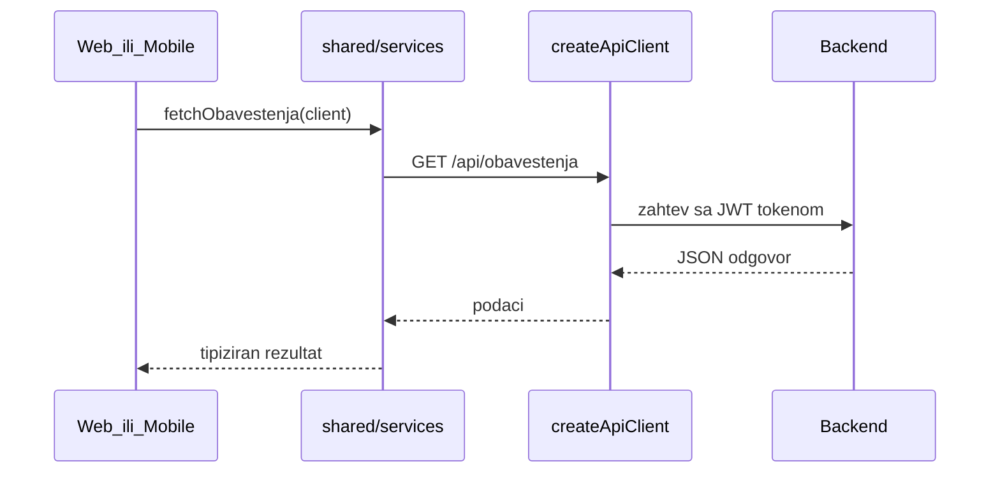
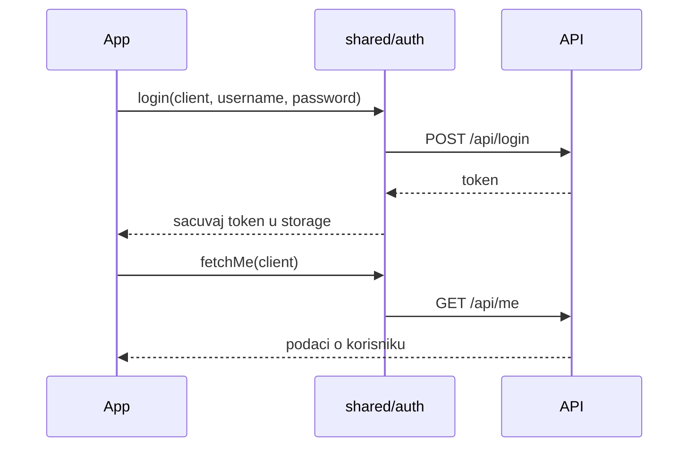

# Shared — debug vodič

## Šta je ovo

`packages/shared` je zajednički kod koji **web** i **mobilna app** dele. Ovde su:

- pozivi ka API-ju (servisi)
- login i sesija
- TypeScript tipovi (kako izgleda Akcija, Korisnik, Obaveštenje…)
- pomoćne funkcije (datumi, wizard, cene)

Web i mobile ne dupliraju istu logiku — oba uvoze iz `@beleg/shared`.

## Kako se koristi

Ne pokreće se samostalno. Uvozi se u web (`src/`) i mobile (`apps/mobile/src/`).

```ts
import { createApiClient } from '@beleg/shared'
import { fetchObavestenja } from '@beleg/shared/services'
import type { Akcija } from '@beleg/shared'
```

## Mapa foldera

| Folder | Šta tu radi |
|--------|-------------|
| `src/api/` | `createApiClient` — axios klijent, token, šta se dešava na 401 |
| `src/auth/` | `login`, `fetchMe`, `logoutApi` — prijava i trenutni korisnik |
| `src/services/` | Funkcije po domenu — jedna datoteka = jedna oblast (akcije, klub, obaveštenja…) |
| `src/types/` | Tipovi podataka koji dolaze sa servera |
| `src/utils/` | Pomoćne stvari: format datuma, wizard podrazumevane vrednosti, cene |
| `src/map/` | MapTiler stil za mapu |
| `src/domain/` | Manji zajednički delovi (npr. invite kod format) |

## Servisi — šta gde tražiti

| Datoteka | Za šta |
|----------|--------|
| `actions.ts` | Akcije — lista, kreiranje, prijave, završetak |
| `obavestenja.ts` | Obaveštenja — lista, pročitano, detalj |
| `pushTokens.ts` | Registracija push tokena za telefon |
| `club.ts` | Klub, članovi, join zahtevi |
| `finansije.ts` | Transakcije, članarine |
| `zadaci.ts` | Zadaci kluba |
| `posts.ts` | Feed, lajkovi, komentari |
| `follows.ts` / `blocks.ts` | Praćenje i blokiranje |
| `catalog.ts` | Ferate, vrhovi, hoteli (javni katalog) |
| `ferrataGuideBookings.ts` / `peakGuideBookings.ts` | Rezervacije vodiča |
| `steps.ts` / `activities.ts` | Koraci i GPS avanture |
| `superadmin.ts` | Superadmin panel |
| `users.ts` | Profili korisnika |

## Glavni tok — kako ide zahtev



**Prijava:**



## Kad nešto ne radi — gde gledati

| Simptom | Gde gledati |
|---------|-------------|
| Web radi, mobile ne (ili obrnuto) | Da li oba koriste istu funkciju iz `services/`? Ako je logika samo u web `src/services/`, mobile je ne vidi. |
| Tip ne odgovara onome što API vraća | `src/types/` + backend `internal/models/` |
| 401 na oba klijenta | `src/api/` — token, `setUnauthorizedHandler`; storage u web/mobile |
| Greška „Cannot find module @beleg/shared" | `npm install` u root-u; web koristi workspace, mobile `file:../../packages/shared` |
| Nova API ruta ne postoji ovde | Dodaj funkciju u odgovarajući `services/*.ts` i export u `services/index.ts` |

## Povezano

- Web: [`src/DEBUG.md`](../../src/DEBUG.md)
- Mobile: [`apps/mobile/DEBUG.md`](../../apps/mobile/DEBUG.md)
- Backend (odakle dolaze podaci): [`backend/DEBUG.md`](../../backend/DEBUG.md)
