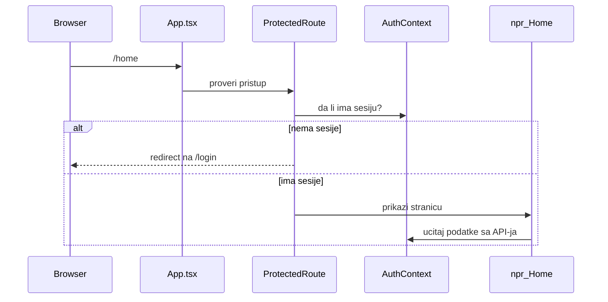
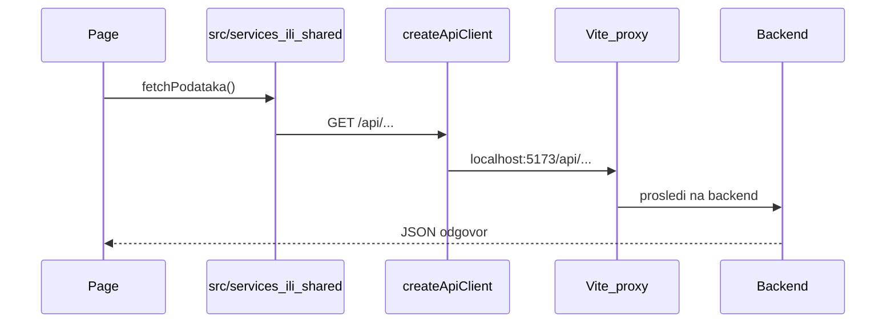

# Web — debug vodič

## Šta je ovo

React web aplikacija (planiner.com). Korisnik otvara stranice u browseru — landing, login, home feed, akcije, klub, finansije, ferate, mapa.

Kod je u root folderu `src/` (nije u `apps/`).

## Kako pokrenuti

```bash
# iz root-a projekta
npm install
npm run dev
```

- Web: `http://localhost:5173`
- API zahteve Vite prosleđuje na backend — vidi `vite.config.ts` (proxy na `/api` i `/login`)

**Backend mora da radi** u isto vreme (`cd backend && go run .`). Proveri da port u `vite.config.ts` odgovara portu na kome backend sluša.

## Odakle kreće kod

```
index.html
  └── src/main.tsx        ← provajderi (auth, modal, react-query, i18n)
        └── src/App.tsx   ← sve rute (koja URL → koja stranica)
```

## Mapa foldera

| Folder | Šta tu radi |
|--------|-------------|
| `src/pages/public/` | Stranice bez logina: landing, login, ferate, mapa, javni profil |
| `src/pages/protected/` | Stranice posle logina: home, klub, finansije, zadaci, superadmin |
| `src/pages/protected/action/` | Akcije — lista, dodavanje, izmena, wizard |
| `src/pages/protected/finance/` | Finansije — tabovi i hookovi |
| `src/pages/protected/user/` | Korisnici, registracija, podešavanja profila |
| `src/components/` | Delovi UI po funkciji (ferrate, akcije, notifikacije, klub, mapa…) |
| `src/ui/` | Okvir aplikacije: layout, navigacija, error stranica |
| `src/services/` | Web-specifični API pozivi (marketing, geocoding, javni katalog) |
| `src/context/AuthContext.tsx` | Ko je ulogovan, login/logout |
| `src/components/routes/` | Ko sme na koju stranicu (`ProtectedRoute`, `RoleRoute`…) |
| `src/map/` | MapLibre komponente za mapu |
| `src/hooks/` | Hookovi za akcije, pretragu, ranking |
| `src/i18n/` | Prevodi |

Zajednička logika sa mobile je u [`packages/shared/DEBUG.md`](../packages/shared/DEBUG.md).

## Rute — kako se šta otvara

Glavni fajl: `src/App.tsx`

| Tip | Primer URL | Zaštita |
|-----|------------|---------|
| Javno | `/`, `/login`, `/ferate`, `/mapa` | Niko |
| Javno deljivo | `/akcije/:id`, `/profil/:username` | Niko |
| Zaštićeno | `/home`, `/finansije`, `/klub` | `ProtectedRoute` — moraš biti ulogovan |
| Po ulozi | `/superadmin/*` | `RoleRoute` — samo superadmin |
| Samo sa klubom | `/zadaci` | `ClubScopedRoute` |

## Glavni tokovi

### Otvaranje zaštićene stranice



### API poziv



### Obaveštenja na web-u

1. Backend kreira obaveštenje (`NotifyUsers`)
2. Web učitava listu: `fetchObavestenja` iz `@beleg/shared`
3. Stranice: `Obavestenja.tsx` (lista), `ObavestenjeDetalj.tsx` (detalj)

Web **nema** push notifikacije u browser traci kao mobile — samo in-app lista.

## Gde da tražiš po funkciji

| Tražiš… | Gde |
|---------|-----|
| Nova ruta / 404 | `src/App.tsx` |
| Login redirect | `src/components/routes/ProtectedRoute.tsx` |
| Ko sme na stranicu | `RoleRoute.tsx`, `ClubScopedRoute.tsx` |
| Home feed | `src/pages/protected/Home.tsx` |
| Akcije | `src/pages/protected/action/` |
| Ferate | `src/pages/public/FerrataList.tsx`, `FerrataDetail.tsx` |
| Komponente ferata | `src/components/ferrate/` |
| Mapa | `src/pages/public/MapaExplore.tsx`, `src/map/` |
| Obaveštenja | `src/pages/protected/Obavestenja.tsx` |
| API klijent | `@beleg/shared` + `src/services/` za web-only |

## Kad nešto ne radi — gde gledati

| Simptom | Gde gledati |
|---------|-------------|
| Bela strana / 404 | `src/App.tsx` — da li ruta postoji? |
| Odmah ide na login | `ProtectedRoute.tsx`, `AuthContext.tsx` — token istekao? |
| API greška u browseru | DevTools → Network; da li backend radi? `vite.config.ts` proxy port |
| CORS greška u produkciji | Backend `CORS_ORIGINS`; ne mešaj sa lokalnim proxy-jem |
| Mapa prazna / siva | `.env` → `VITE_MAPTILER_API_KEY` ili `VITE_MAP_STYLE_URL` |
| Komponenta ne update-uje podatke | React Query cache — `queryKey`, `invalidateQueries` |
| Prevodi nedostaju | `src/i18n/` |

## Korisne komande

```bash
npm run dev       # lokalni razvoj
npm run build     # produkcioni build → dist/
npm run lint      # ESLint
```

## Povezano

- Zajednički kod: [`packages/shared/DEBUG.md`](../packages/shared/DEBUG.md)
- Backend API: [`backend/DEBUG.md`](../backend/DEBUG.md)
- Root README: [`README.md`](../README.md)
